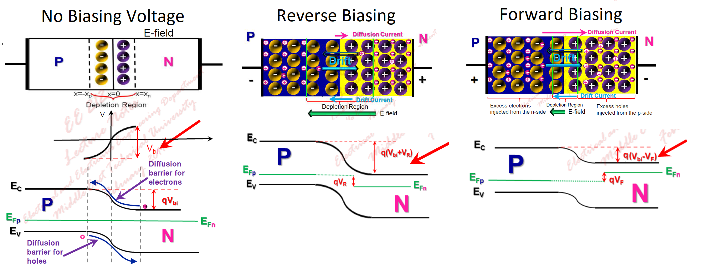
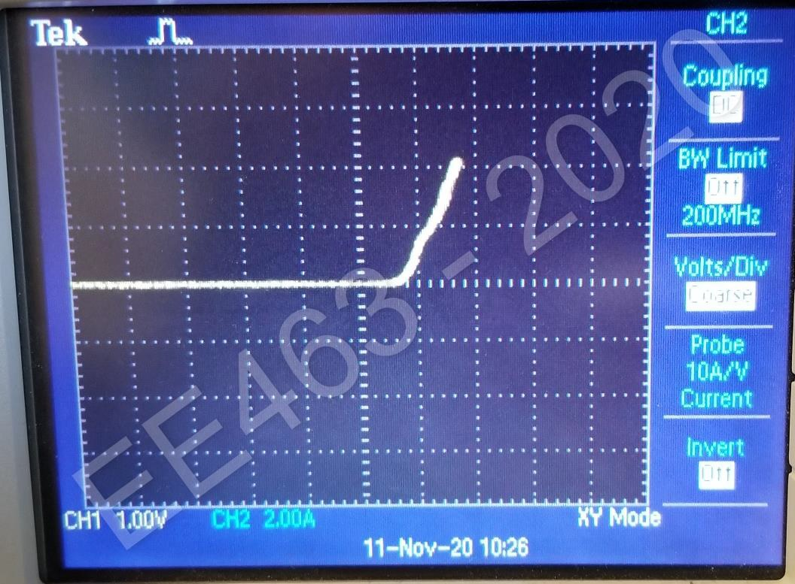
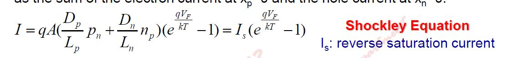
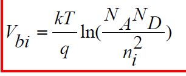

# EE463 Lab #1 - Report

## Report

- **Q1**: The main and significant difference between isolated and non-isolated channel oscilloscope is that the connection of negative terminals. While isolated channel oscilloscopes allow to connect negative terminals of channels seperately, the negative terminals of non-isolated channels shares the same negative terminal. Hence, the safety should be considered according to isolation of channels.

- **Q2**: Diode is simply a P-N junction device. While P (*Acceptors*) side includes holes, N (*Donors*) side includes electrons. When the junction is provided between **N** and **P** sides, the holes diffuses to P side, vice versa. Hence, there are immobile donors (+, electrons diffused to P side) in N side and there are immobile acceptors in P side, which constructs *built-in E-field* from N side to P side.
  *Built-in E-field* is a barrier for diffusion of electrons and holes. As the barrier voltage difference through the junction decreases with forward biasing, the forward current increases exponentially. The required voltage to pass current is named as forward voltage. Figure XXX shows how the voltage difference constructs a barrier for diffusion under no biasing, forward biasing and reverse biasing.

  * There are two important effective parameters on diode forward voltage: forward current and temperature.
    * Forward Current: The forward voltage drop on diode increase with forward current. As seen in Figure , I-V characteristics of diode reveals that diode can be represented with small resistance in operating limits. Hence, forward current results in increase in forward voltage drop.
    
    On the other hand of the analogy for relation between forward voltage and current, Eqn. XXX represents the relation between forward voltage and current accurately.
    
    

    * Temperature: The thermal generation rate depends on temperature in semiconductor devices. The carrier concentration increases with temperature. Also, the temperature affects magnitude of depletion voltage. The Eqn. XXX shows how temperature changes the barrier voltage.
    

- **Q3**: Increase in peak of the input  voltage results in higher current. Thus, the forward voltage on diode increases due to demand of high current. The diffusion barrier is made smaller by higher forward voltage to provide higher forward current. 
  * Expected Results: 
    * Increase in V~F~.

- **Q4**:
  * Conduction losses: Forward (+) current, forward voltage >> *power loss*
  * Switching losses: Recovery charge (High peak current), negative voltage >> *power loss*
  * Reverse current Losses: Negative current, negative voltage >> *power loss*

    
